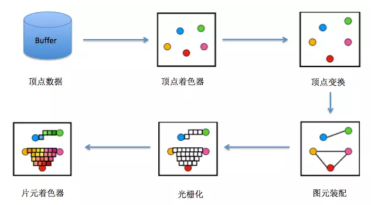
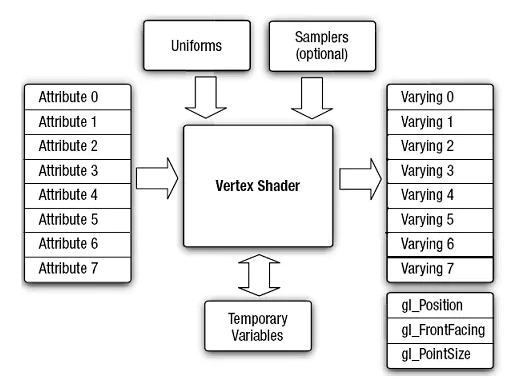
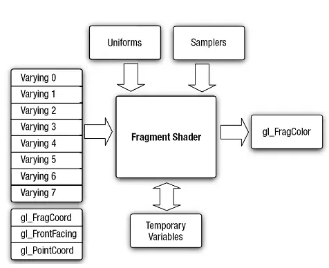

# Camera - docs/advanced 

​	从 Android 5.0 开始，Google 引入了一套全新的相机框架 Camera2，旧的被废弃，本项目主要为Camera2 的重要概念和使用方法的说明文档。

## 进阶内容 - 使用opengl

#### **3.1**     **GL**简介

​	OpenGL（全写Open Graphics Library）是指定义了一个跨编程语言、跨平台的编程接口规格的专业的图形程序接口。它用于三维图像（二维的亦可），是一个功能强大，调用方便的底层图形库。

​	OpenGL ES (OpenGL for Embedded Systems) 是 OpenGL 三维图形 API 的子集，针对手机、PDA和游戏主机等嵌入式设备而设计。

​	OpenGL ES相对于OpenGL来说，减少了许多不是必须的方法和数据类型，去掉了不必须的功能，对代价大的功能做了限制，比OpenGL更为轻量。在OpenGL ES的世界里，没有四边形、多边形，无论多复杂的图形都是由点、线和三角形组成的，也去除了glBegin/glEnd等方法。

​	OpenGL ES是手机、PDA和游戏主机等嵌入式设备三维（二维也包括）图形处理的API，当然是用来在嵌入式设备上的图形处理了，OpenGL ES 强大的渲染能力使其成为我们在嵌入式设备上进行图形处理的优良选择。我们经常使用的场景有：

l  图片处理。比如图片色调转换、美颜等。

l  摄像头预览效果处理。比如美颜相机、恶搞相机等。

l  视频处理。摄像头预览效果处理可以，这个自然也不在话下了。

l  3D游戏。比如神庙逃亡、都市赛车等。

​	本文旨在使用OpenGl ES对摄像头的预览效果进行处理。

#### **3.2**     **EGL**

​	EGL是渲染API(如OpenGL, OpenGL ES, OpenVG)和本地窗口系统之间的接口。它处理图形上下文管理，表面/缓冲区创建，绑定和渲染同步，并使用其他Khronos API实现高性能，加速，混合模式2D和3D渲染OpenGL / OpenGL ES渲染客户端API OpenVG渲染客户端API原生平台窗口系统。在安卓中的GlSurfaceView已经将EGL环境都给配置好了，因此我们只要知道他是一个用来给OpenGl ES提供绘制界面的接口就可以了。

#### **3.3**     **使用OpenGl ES的部分内容介绍**

##### 1)   opengl的渲染流程

​	图形渲染的基本单位就是点，两个点之间用点渲染成线，三个点之间渲染成面，一个面就是由一个或多个三角形组成，3D物体就是由许许多多的三角形拼接而成。渲染完图形的框架后，可以在每个点上添加颜色，或者加上图片对应点的颜色，看起来就是一个完整的物体了。在绘制时，简单的图形我们可以自己定义，复杂的需要用工具导出数据，这些数据包括顶点信息、纹理信息、法线信息，这里的法线是用来做光照效果的，就算漫反射也是由无数个镜面反射组成的，法线就是用来计算反射角，这样的计算是由系统来做的。

​	关于3D，我们的手机是一个平面，所看的3D效果是由数据经过一系列的矩阵变换，投影到平面上展示的。移动、平移、缩放，矩阵的变换是不可缺少的。

​	图像顶点数据到显示结果有以下几个大体的过程



##### 2)   着色器语言

​	着色器语言（opengl-shader-language）是一种高级的图形编程语言，仅适合于GPU编程，其源自应用广泛的C语言。在可编程管线中我们必须要纯手写顶点和片源着色器，因此必须使用GLSL。下面将介绍一些GLSL中常用的变量、修饰符：

l  C语言的部分常见变量，如void、bool、int、float

l  浮点数向量，如vec2, vec3, vec4，其中数字表示向量的维数（例.用vec3表示三维坐标）

l  布尔类向量，如bvec2, bvec3, bvec4

l  整型向量，ivec2, ivec3, ivec4

l  n*n矩阵，mat2, mat3, mat4

l  2D纹理，sampler2D

l  盒纹理，samplerCube

l  attribute  表示只读的顶点数据，只用在顶点着色器中。数据来自当前的顶点状态或者顶点数组。它必须是全局范围声明的，不能在函数内部。一个attribute可以是浮点数类型的标量，向量，或者矩阵。不可以是数组或则结构体。

l  uniform    一致变量。在着色器执行期间一致变量的值是不变的。与const常量不同的是，这个值在编译时期是未知的是由着色器外部初始化的。一致变量在顶点着色器和片段着色器之间是共享的。它也只能在全局范围进行声明。

l  varying    顶点着色器的输出。例如颜色或者纹理坐标，（插值后的数据）作为片段着色器的只读输入数据。必须是全局范围声明的全局变量。可以是浮点数类型的标量，向量，矩阵。不能是数组或者结构体。

l  in  用在函数的参数中，表示这个参数是输入的，在函数中改变这个值，并不会影响对调用的函数产生副作用。（相当于C语言的传值），这个是函数参数默认的修饰符

l  out 用在函数的参数中，表示该参数是输出参数，值是会改变的。

l  inout  用在函数的参数，表示这个参数即是输入参数也是输出参数。

l  layout 布局限定符，用于着色器输入/输出变量接口布局，可以指定顶点着色器输入变量使用的顶点属性索引值（layout(location = n) 表示这个变量的属性索引值为n）

l  顶点着色器内置属性gl_Position  vec4   输出属性-变换后的顶点的位置，用于后面的固定的裁剪等操作。所有的顶点着色器都必须写这个值。

l  顶点着色器内置属性gl_PointSize float  点的大小

l  片元着色器内置属性gl_FragCoord vec4   只读输入，窗口的x,y,z和1/w

l  片元着色器内置属性gl_PointCoord    vec2   点精灵的二维空间坐标范围在(0.0, 0.0)到(1.0, 1.0)之间，仅用于点图元和点精灵开启的情况下。

l  gl_FrontFacing    bool   只读输入，如果是窗口正面图元的一部分，则这个值为true

##### 3)   顶点着色器

​	着色器（Shader）是在GPU上运行的小程序。从名称可以看出，可通过处理它们来处理顶点。此程序使用OpenGL ES SL语言来编写。它是一个描述顶点或像素特性的简单程序。

​	对于发送给GPU的每一个顶点，都要执行一次顶点着色器。其功能是把每个顶点在虚拟空间中的三维坐标变换为可以在屏幕上显示的二维坐标，并带有用于z-buffer的深度信息。顶点着色器可以操作的属性有：位置、颜色、纹理坐标，但是不能创建新的顶点。



##### 4)   片元着色器

​	片元着色器计算每个像素的颜色和其它属性。它通过应用光照值、凹凸贴图，阴影，镜面高光，半透明等处理来计算像素的颜色并输出。它也可改变像素的深度(z-buffering)或在多个渲染目标被激活的状态下输出多种颜色。一个片元着色器不能产生复杂的效果，因为它只在一个像素上进行操作，而不知道场景的几何形状。

​	片元着色器的输入输出模型如下：



##### 5)   坐标系

​	OpenGL ES采用的是右手坐标，选取屏幕中心为原点，从原点到屏幕边缘默认长度为1，也就是说默认情况下，从原点到（1,0,0）的距离和到（0,1,0）的距离在屏幕上展示的并不相同。即向右为X正轴方向，向左为X负轴方向，向上为Y轴正轴方向，向下为Y轴负轴方向，屏幕面垂直向上为Z轴正轴方向，垂直向下为Z轴负轴方向。

#### **3.4**     **Opengles**相机预览

##### 1)   实现预览的思路

​	android 相机的预览数据可以输出到 SurfaceTexture 上，所以用 opengles 做相机预览的主要思路如下：

l  在 GLSurfaceView.Render 中创建一个纹理，再使用该纹理创建一个 SurfaceTexture

l  使用该 SurfaceTexture 创建一个 Surface 传给相机，相机预览数据就输出到一个纹理上了

l  使用 GLSurfaceView.Render 将该纹理渲染到 GLSurfaceView 窗口上

l  使用 SurfaceTexture 的 setOnFrameAvailableListener 方法 给 SurfaceTexture 添加一个数据帧数据可用的监听器，在监听器中 调用 GLSurfaceView 的 requestRender 方法渲染该帧数据，这样相机每次输出一帧数据就可以渲染一次，在GLSurfaceView窗口中就可以看到相机的预览数据了

##### 2)   顶点着色器的设置

```
    #version 300 es
    layout (location = 0) in vec4 a_Position;
    layout (location = 1) in vec2 a_texCoord;
    out vec2 v_texCoord;
    void main()
    {
        gl_Position = a_Position;
        v_texCoord = a_texCoord;
    }
```

​	在上述顶点着色器中，第一行是glsl版本的声明，第二三行声明了输入的属性a_Position和a_texCoord，且其属性索引值为0和1.然后定义了一个输出变量v_texCoord。因此，该着色器的最终效果是对输入中的顶点坐标赋值给顶点着色器内置的顶点坐标变量，获取输入的材质UV坐标，并作为输出传给片元着色器。

##### 3)   片元着色器的设置

```
    #version 300 es
    #extension GL_OES_EGL_image_external_essl3 : require
    precision mediump float;

    in vec2 v_texCoord;
    out vec4 outColor;
    uniform samplerExternalOES s_texture;

    void main(){
        outColor = texture(s_texture, v_texCoord);
    }
```

​	在上述着色器中，第一行为glsl的版本，第二行则是申请对GL_OES_EGL_image_external_essl3纹理拓展的支持。第三行声明了float类型的精度范围。接着是一个输入变量v_texCoord、一个输出变量outColor和一个一致变量s_texture，这里要注意的是一直变量的类型是samplerExternalOES，这是一种纹理的类型，如果我们要做相机预览，则需使用这种类型的变量。然后我们就可以得出上述着色器的用处为，通过传入的纹理UV坐标v_texCoord去获取相应位置上材质s_texture的颜色并作为输出传给主程序。

##### 4)   工具类GLUtil

​	在这个类中，我们定义了一些方法用于加载纹理和着色器。接下来我们会一一讲解每个方法的作用。

```
	/*********************** 纹理 ************************/
	public static int loadTextureFromRes(int resId){
        //创建纹理对象
        int[] textureId = new int[1];
        //生成纹理：纹理数量、保存纹理的数组，数组偏移量
        glGenTextures(1, textureId,0);
        if(textureId[0] == 0){
            Log.e(TAG, "创建纹理对象失败");
        }
        //原尺寸加载位图资源（禁止缩放）
        BitmapFactory.Options options = new BitmapFactory.Options();
        options.inScaled = false;
        Bitmap bitmap = BitmapFactory.decodeResource(context.getResources(), resId, options);
        if (bitmap == null){
            //删除纹理对象
            glDeleteTextures(1, textureId, 0);
            Log.e(TAG, "加载位图失败");
        }
        //绑定纹理到opengl
        glBindTexture(GL_TEXTURE_2D, textureId[0]);
        //设置放大、缩小时的纹理过滤方式，必须设定，否则纹理全黑
        glTexParameterf(GL_TEXTURE_2D, GL_TEXTURE_MIN_FILTER, GL_NEAREST);
        glTexParameterf(GL_TEXTURE_2D, GL_TEXTURE_MAG_FILTER, GL_NEAREST);
        //将位图加载到opengl中，并复制到当前绑定的纹理对象上
        texImage2D(GL_TEXTURE_2D, 0, bitmap, 0);
        //释放bitmap资源（上面已经把bitmap的数据复制到纹理上了）
        bitmap.recycle();
        //解绑当前纹理，防止其他地方以外改变该纹理
        glBindTexture(GL_TEXTURE_2D, 0);
        //返回纹理对象
        return textureId[0];
    }
```

​	在上述代码中，我们实现了将目标png图片转化成位图，然后将位图加载到opengl中并绑定到纹理的功能。由于注释十分详细，这里不对代码做过多的解析，唯一需要注意的是，我们传入的resId，实际上指代我们在res/drawable文件夹下的某一png文件，只不过经过系统的自动编译变成了一个int型的变量而已。在实际使用中，我们可以使用R.drawable.XXX来获取XXX对应的resId。

```
	/*********************** 着色器、程序 ************************/
    public static String loadShaderSource(int resId){
        StringBuilder res = new StringBuilder();

        InputStream is = context.getResources().openRawResource(resId);
        InputStreamReader isr = new InputStreamReader(is);
        BufferedReader br = new BufferedReader(isr);

        String nextLine;
            try {
                while ((nextLine = br.readLine()) != null) {
                    res.append(nextLine);
                    res.append('\n');
                }
            } catch (IOException e) {
                e.printStackTrace();
            }
        return res.toString();
    }
```

​	上述代码实现的是添加着色器源。通过context.getResources().openRawResource(resId)方法，我们可以获取raw文件夹下写好的Shader文件，其resId的获取方法类似于纹理图片resId的获取方式。最后，上述方法将我们的着色器代码解析成一行的字符串，这一串字符串我们后面会用到。

```
	public static int loadShader(int type, String shaderSource){
        //创建着色器对象
        int shader = glCreateShader(type);
        if (shader == 0) return 0;//创建失败
        //加载着色器源
        glShaderSource(shader, shaderSource);
        //编译着色器
        glCompileShader(shader);
        //检查编译状态
        int[] compiled = new int[1];
        glGetShaderiv(shader, GL_COMPILE_STATUS, compiled, 0);
        if (compiled[0] == 0) {
            Log.e(TAG, glGetShaderInfoLog(shader));
            glDeleteShader(shader);
            return 0;//编译失败
        }

        return shader;
    }
```

​	上述代码真正实现了从Shader代码到程序中实际使用的shader的转换。我们首先看glCreateShader方法，这个方法接受一个参数，其值只能是GL_VERTEX_SHADER或GL_FRAGMENT_SHADER，表示我们要载入的Shader是顶点着色器还是片元着色器。如果传入其他参数，则返回0表示创建失败。接着是glShaderSource方法，改方法可以把我们从shader代码经转化后得到的字符串加载到实际的shader对象中，然后我们就可以调用glCompileShader对其进行编译。调用glGetShaderiv（该方法的第二个参数可定义我们得到的数组是那种类型的状态信息，如GL_COMPILE_STATUS为编译状态信息，GL_LINK_STATUS为连接状态信息）对编译状态进行查看，如果得到的值为0则表示编译失败，需要使用glDeleteShader删除shader对象以防止错误的渲染。

```
	public static int createAndLinkProgram(int vertextShaderResId, int fragmentShaderResId){
        //获取顶点着色器
        int vertexShader = GLUtil.loadShader(GL_VERTEX_SHADER, loadShaderSource(vertextShaderResId));
        if (0 == vertexShader){
            Log.e(TAG, "failed to load vertexShader");
            return 0;
        }
        //获取片段着色器
        int fragmentShader = GLUtil.loadShader(GL_FRAGMENT_SHADER, loadShaderSource(fragmentShaderResId));
        if (0 == fragmentShader){
            Log.e(TAG, "failed to load fragmentShader");
            return 0;
        }
        int program = glCreateProgram();
        if (program == 0){
            Log.e(TAG, "failed to create program");
        }
        //绑定着色器到程序
        glAttachShader(program, vertexShader);
        glAttachShader(program, fragmentShader);
        //连接程序
        glLinkProgram(program);
        //检查连接状态
        int[] linked = new int[1];
        glGetProgramiv(program,GL_LINK_STATUS, linked, 0);
        if (linked[0] == 0){
            glDeleteProgram(program);
            Log.e(TAG, "failed to link program");
            return 0;
        }
        return program;
    }
```

​	上述代码实现的是获取着色器并将其连接到一个program，这个program对象是可以附加着色器对象的对象。这样我们才能使用编译好的Shader代码借由GLSurfaceView.Renderer对程序中的一些对象进行渲染。首先我们调用之前写好的loaderShader方法以及loadShaderSource方法实现对shader代码到shader实例的加载，然后创建一个program实例，并连接shder对象。至于如何使用program，我们在后面的部分会进行讲解。

##### 5)   工具类CommonUtil的实现

​	这个类中只包含两个方法，一个是查看gl版本的checkGLVersion方法，实际中为了简化问题并未用到，另一个是将顶点数据拷贝到native内存中的getFloatBuffer方法。此处由于代码注释十分详细，只给出代码。

```
	public static boolean checkGLVersion(Context context){
        ActivityManager am = (ActivityManager) context.getSystemService(ACTIVITY_SERVICE);
        ConfigurationInfo ci = am.getDeviceConfigurationInfo();
        return ci.reqGlEsVersion >= 0x30000;
    }

    public static FloatBuffer getFloatBuffer(float[] array){
        //将顶点数据拷贝映射到 native 内存中，以便opengl能够访问
        FloatBuffer buffer = ByteBuffer
                .allocateDirect(array.length * BYTES_PER_FLOAT)//直接分配 native 内存，不会被gc
                .order(ByteOrder.nativeOrder())//和本地平台保持一致的字节序（大/小头）
                .asFloatBuffer();//将底层字节映射到FloatBuffer实例，方便使用
        buffer
                .put(array)//将顶点拷贝到 native 内存中
                .position(0);//每次 put position 都会 + 1，需要在绘制前重置为0

        return buffer;
    }
```


##### 6)   实现Render

​	这里给出我们进行部分函数封装前的Render代码，在这段代码中需要使用纹理创建一个 SurfaceTexture，并提供 SurfaceTexture 实例的获取方法，以便后续相机获取使用。

```
    public class GLRender implements GLSurfaceView.Renderer{
        private static final String VERTEX_ATTRIB_POSITION = "a_Position";
        private static final int VERTEX_ATTRIB_POSITION_SIZE = 3;
        private static final String VERTEX_ATTRIB_TEXTURE_POSITION = "a_texCoord";
        private static final int VERTEX_ATTRIB_TEXTURE_POSITION_SIZE = 2;
        private static final String UNIFORM_TEXTURE = "s_texture";

        private  float[] vertex ={
                -1f,1f,0.0f,//左上
                -1f,-1f,0.0f,//左下
                1f,-1f,0.0f,//右下
                1f,1f,0.0f//右上
        };

        //纹理坐标，（s,t），t坐标方向和顶点y坐标反着
        public float[] textureCoord = {
                0.0f,1.0f,
                1.0f,1.0f,
                1.0f,0.0f,
                0.0f,0.0f
        };

        private FloatBuffer vertexBuffer;
        private FloatBuffer textureCoordBuffer;

        private int program;

        //接收相机数据的纹理
        private int[] textureId = new int[1];
        //接收相机数据的 SurfaceTexture
        public SurfaceTexture surfaceTexture;

        public GLRender() {
            //初始化顶点数据
            initVertexAttrib();
        }

        private void initVertexAttrib() {
            textureCoordBuffer = GLUtil.getFloatBuffer(textureCoord);
            vertexBuffer = GLUtil.getFloatBuffer(vertex);
        }

        //向外提供 surfaceTexture 实例
        public SurfaceTexture getSurfaceTexture(){
            return surfaceTexture;
        }

        @Override
        public void onSurfaceCreated(GL10 gl, EGLConfig config) {
            //创建纹理对象
            glGenTextures(textureId.length, textureId, 0);
            //将纹理对象绑定到srufaceTexture
            surfaceTexture = new SurfaceTexture(textureId[0]);
            //创建并连接程序
            program = GLUtil.createAndLinkProgram(R.raw.texture_vertex_shader, R.raw.texture_fragtment_shader);
            //设置清除渲染时的颜色
            glClearColor(1.0f, 1.0f, 1.0f, 0.0f);
        }

        @Override
        public void onSurfaceChanged(GL10 gl, int width, int height) {
            glViewport(0,0,width,height);
        }

        @Override
        public void onDrawFrame(GL10 gl) {
            //srufaceTexture 获取新的纹理数据
            surfaceTexture.updateTexImage();
            glClear(GL_COLOR_BUFFER_BIT);
            glUseProgram(program);

            int vertexLoc = glGetAttribLocation(program, VERTEX_ATTRIB_POSITION);
            int textureLoc = glGetAttribLocation(program, VERTEX_ATTRIB_TEXTURE_POSITION);

            glEnableVertexAttribArray(vertexLoc);
            glEnableVertexAttribArray(textureLoc);

            glVertexAttribPointer(vertexLoc,
                    VERTEX_ATTRIB_POSITION_SIZE,
                    GL_FLOAT,
                    false,
                    0,
                    vertexBuffer);

            glVertexAttribPointer(textureLoc,
                    VERTEX_ATTRIB_TEXTURE_POSITION_SIZE,
                    GL_FLOAT,
                    false,
                    0,
                    textureCoordBuffer);

            //绑定0号纹理单元纹理
            glActiveTexture(GL_TEXTURE0);
            //将纹理放到当前单元的 GL_TEXTURE_BINDING_EXTERNAL_OES 目标对象中
            glBindTexture(GLES11Ext.GL_TEXTURE_EXTERNAL_OES, textureId[0]);
            //设置纹理过滤参数
            glTexParameterf(GLES11Ext.GL_TEXTURE_EXTERNAL_OES, GL_TEXTURE_MIN_FILTER,GL_NEAREST);
            glTexParameterf(GLES11Ext.GL_TEXTURE_EXTERNAL_OES, GL_TEXTURE_MAG_FILTER, GL_LINEAR);
            glTexParameterf(GLES11Ext.GL_TEXTURE_EXTERNAL_OES, GL_TEXTURE_WRAP_S, GL_CLAMP_TO_EDGE);
            glTexParameterf(GLES11Ext.GL_TEXTURE_EXTERNAL_OES, GL_TEXTURE_WRAP_T,GL_CLAMP_TO_EDGE);
            //将片段着色器的纹理属性值（s_texture）设置为 0 号单元
            int uTextureLoc = glGetUniformLocation(program, UNIFORM_TEXTURE);
            glUniform1i(uTextureLoc,0);

            glDrawArrays(GL_TRIANGLE_FAN,0,vertex.length / 3);

            glDisableVertexAttribArray(vertexLoc);
            glDisableVertexAttribArray(textureLoc);
        }
    }
```

​	我们来分析一下上面这段代码。

​	首先在代码一开始设置五个静态局部变量，其作用是定义一些我们在Shader代码中使用的部分变量的变量名和每个顶点属性的组件数量。以a_Position为例，它包含xyz三个分量，因此其顶点属性组件数量为3.如果你认真观察了前面的顶点着色器代码或许会发现，我们实际上输入到顶点着色器中的a_Position是一个四维的float向量，这是由于gl_Position是归一化的裁剪空间坐标，因此它还需要第四维形成齐次坐标，而我们给其赋值所使用的a_Position也必须是四维向量。

​	接下来的两个矩阵则是我们的位置数据在缓冲区起始位置的偏移量，两者分别是物体坐标的偏移（这里是图片因此z轴全为0）和纹理坐标的偏移。

​	后面的几行代码包括了一些变量的设置以及顶点数据初始化等操作。我们忽略这些操作，重点看最后的三个方法。

​	第一个方法onSurfaceCreated是在SurfaceTexture被创建时创建纹理对象并连接程序，第二个onSurfaceChanged方法是在SurfaceTexture被改变的时候重新设置视点，最后一个onDrawFrame方法最为重要，他是我们实现gl滤镜的基础。

​	通过前面的讲解我们得知，如果我们传入了位置坐标、纹理坐标， 就能从顶点着色器中得到一个纹理坐标的输出，然后将这个坐标连同渲染用的纹理一起传给片段着色器，就能得到各顶点最终的颜色。了解了这些我们就可以解析onDrawFrame方法了。

​	在onDrawFrame中我们需要先调用先调用 SurfaceTexture 的 updateTexImage 方法，更新纹理，通过glUseProgram方法应用program，用glGetAttribLocation获取a_Position、a_texCoord中的索引。之后，我们就可以用glVertexAttribPointer方法向顶点着色器传递数据了。

​	glVertexAttribPointer包含六个参数：

l  第一个参数指定从索引0开始取数据，与顶点着色器中layout(location=0)对应。

l  第二个参数指定顶点属性大小。

l  第三个参数指定数据类型。

l  第四个参数定义是否希望数据被标准化（归一化），只表示方向不表示大小。

l  第五个参数是步长（Stride），指定在连续的顶点属性之间的间隔。上面传0和传4效果相同，如果传1取值方式为0123、1234、2345……

l  第六个参数表示我们的位置数据在缓冲区起始位置的偏移量。

​	因此，我们在第一个参数传入之前获取的索引值，第二三个参数传入一开始设置好的变量，第六个参数传入之前转换成floatBuffer的位置坐标偏移量。然后就是纹理的绑定与设置片元着色器第二个参数s_texture。

##### 7)   预览的实现

​	此处预览的实现与前文中Camera2的预览实现类似，只需要通过 SurfaceTexture 实例创建一个 Surface ，传给相机即可。需要注意的是此处的SurfaceTexture由glRender创建。

```
    //获取Render中的 SurfaceTexture 实例
    surfaceTexture = glRender.getSurfaceTexture();
    if (surfaceTexture == null) {
    	return;
    }
    surfaceTexture.setDefaultBufferSize(photoSize.getWidth(), photoSize.getHeight());
    //添加帧可用监听，让GLSurfaceView 进行渲染
    surfaceTexture.setOnFrameAvailableListener(new SurfaceTexture.OnFrameAvailableListener() {
        @Override
        public void onFrameAvailable(final SurfaceTexture surfaceTexture) {
            glSurfaceView.requestRender();
        }
    });
    //通过 SurfaceTexture 实例创建一个 Surface
    surface = new Surface(surfaceTexture);

    try {
        cameraDevice = camera;
        previewRequestBuilder = cameraDevice.createCaptureRequest(CameraDevice.TEMPLATE_PREVIEW);
        //将 surface 传给相机
        previewRequestBuilder.addTarget(surface);
        previewRequest = previewRequestBuilder.build();

        cameraDevice.createCaptureSession(Arrays.asList(surface), sessionsStateCallback, null);
    } catch (CameraAccessException e) {
        e.printStackTrace();
        Log.d(TAG, "相机访问异常");
    }
```

#### **3.5**     **点算子实现的滤镜**

##### 1)   实现滤镜的思路

​	滤镜本质上就是对每个位置的颜色值进行调整，比如灰度效果，就是将彩色图像的各个颜色分量的值变成一样的。对颜色值进行调整的时机应该是已经拿到了颜色值，还没有输出到颜色缓冲区的时候，这个时候我们对颜色值进行处理就可以实现滤镜效果。

##### 2)   灰度滤镜

​	灰度滤镜通过图像的灰度化算法进行实现。

​	在 RBG颜色模型中，让 R=G=B=grey， 即可将彩色图像转为灰度图像，其中 grey 叫做灰度值。

​	grey的计算方法有四种：分量法，最大值法，平均值法、加权平均法。

l  分量法

​	使用彩色图像的某个颜色分量的值作为灰度值。

​	Ø  grey=R：R分量灰度图

​	Ø  grey=G：G分量灰度图

​	Ø  grey=B：B分量灰度图

l  最大值法

​	将彩色图像三个颜色分量中值最大的作为灰度值。

​	grey = max(R,G,B)

l  平均值法

​	将彩色图像的三个颜色分量值的平均值作为灰度值

​	grey = (R+G+B)/3

l  加权平均法

​	在 RGB 颜色模型中，人眼对G（绿色）的敏感度最高，对B（蓝色）的敏感的最低，所以对彩色图像的三个颜	色分量做加权平均计算灰度值效果比较好。

​	grey = 0.3R + 0.59G + 0.11*B

​	接下来展示在片段着色器中使用加权平局法实现灰度滤镜。

```
#version 300 es
#extension GL_OES_EGL_image_external_essl3 : require
precision mediump float;

in vec2 v_texCoord;
out vec4 outColor;
uniform samplerExternalOES s_texture;

//灰度滤镜
void grey(inout vec4 color){
    float weightMean = color.r * 0.3 + color.g * 0.59 + color.b * 0.11;
    color.r = color.g = color.b = weightMean;
}

void main(){
    //拿到颜色值
    vec4 tmpColor = texture(s_texture, v_texCoord);
    //对颜色值进行处理
    grey(tmpColor);
    //将处理后的颜色值输出到颜色缓冲区
    outColor = tmpColor;
}
```

##### 3)   黑白滤镜

​	黑白滤镜就是将图像进行二值化处理，彩色图像的颜色值经过处理之后，要么是 0（黑色），要么是255（白色）。

​	实际应用中使用的不多，从各大直播、美颜相机、短视频app上就能发现，基本上没有用黑白滤镜，因为不好看。

​	二值化方法主要有：全局二值化，局部二值化，局部自适应二值化。最影响效果的就是阈值的选取。

​	全局二值化是选定一个阈值，然后将大于该阈值的颜色值置为255，小于该阈值的颜色置为0。因为使用的全局阈值，所以会丧失很多细节。

​	局部二值化：为了弥补全局阈值化的缺陷，将图像分为N个窗口，每个窗口设定一个阈值，进行二值化操作，一般取该窗口颜色值的平均值。

​	局部自适应二值化：局部二值化的阈值选取方法仍然不能很好的将对应窗口的图像进行二值化，在此基础上，通过窗口颜色的平均值E、像素之间的差平方P、像素之间的均方根Q等能够表示窗口内局部特征的参数，设定计算公式计算阈值。

​	这里使用最简单的全局二值化做个示例

```
    //黑白滤镜
    void blackAndWhite(inout vec4 color){
        float threshold = 0.5;
        float mean = (color.r + color.g + color.b) / 3.0;
        color.r = color.g = color.b = mean >= threshold ? 1.0 : 0.0;
    }
```

##### 4)   反色滤镜

​	RGB 颜色值的范围是 [0,255]，反色滤镜的的原理就是将 255 与当前颜色的每个分量Rs,Gs,Bs值做差运算。

结果颜色为 (R,G,B) = (255 - Rs, 255 - Gs, 255 - Bs);

```
    void reverse(inout vec4 color){
        color.r = 1.0 - color.r;
        color.g = 1.0 - color.g;
        color.b = 1.0 - color.b;
    }
```

##### 5)   亮度滤镜

​	增加亮度有两种方法：

​	在rgb 颜色空间下，将各个颜色分量都加上一个值，可以达到图像亮度增加的目的，但是这种方式会导致图像一定程度上偏白。

​	将颜色值从 rgb 颜色空间转换到 hsl 颜色空间上，因为 hsl 更适合视觉上的描述，色相、饱和度、亮度，调整 l（亮度分量），即可实现图像的亮度处理，然后将调整后的 hsl 值再转换到 rgb 颜色空间上进行输出。

​	下面给出两种方式的shader代码

```
    //rgb转hsl
    vec3 rgb2hsl(vec3 color){
        vec4 K = vec4(0.0, -1.0 / 3.0, 2.0 / 3.0, -1.0);
        vec4 p = mix(vec4(color.bg, K.wz), vec4(color.gb, K.xy), step(color.b, color.g));
        vec4 q = mix(vec4(p.xyw, color.r), vec4(color.r, p.yzx), step(p.x, color.r));

        float d = q.x - min(q.w, q.y);
        float e = 1.0e-10;
        return vec3(abs(q.z + (q.w - q.y) / (6.0 * d + e)), d / (q.x + e), q.x);
    }

    //hsla转rgb
    vec3 hsl2rgb(vec3 color){
        vec4 K = vec4(1.0, 2.0 / 3.0, 1.0 / 3.0, 3.0);
        vec3 p = abs(fract(color.xxx + K.xyz) * 6.0 - K.www);
        return color.z * mix(K.xxx, clamp(p - K.xxx, 0.0, 1.0), color.y);
    }

    //亮度
    void light(inout vec4 color){
        vec3 hslColor = vec3(rgb2hsl(color.rgb));
        hslColor.z += 0.15;
        color = vec4(hsl2rgb(hslColor), color.a);
    }
```

##### 6)   色调分离

​	色调分离的原理简单来说就是根据图像的直方图，将图像分为阴影、中间、高光三个部分，在hsl颜色空间中调整每个部分的色相、饱和度。调整色相可以对图像进行色彩调整，调整饱和度可以使图像整体的颜色趋于一个整体的风格。

```
    //色调分离
    void saturate(inout vec4 color){
        //计算灰度值
        float grayValue = color.r * 0.3 + color.g * 0.59 + color.b * 0.11;
        //转换到hsl颜色空间
        vec3 hslColor = vec3(rgb2hsl(color.rgb));
        //根据灰度值区分阴影和高光，分别处理
        if(grayValue < 0.3){
            //添加蓝色
            if(hslColor.x < 0.68 || hslColor.x > 0.66){
                hslColor.x = 0.67;
            }
            //增加饱和度
            hslColor.y += 0.3;
        }else if(grayValue > 0.7){
            //添加黄色
            if(hslColor.x < 0.18 || hslColor.x > 0.16){
                hslColor.x = 0.17;
            }
            //降低饱和度
            hslColor.y -= 0.3;
        }
        color = vec4(hsl2rgb(hslColor), color.a);
    }
```

#### **3.6**     **LUT****滤镜**

##### 1)   基本思路

l  准备LUT文件

l  加载LUT文件加载到opengl纹理

l  将纹理传递到到片段着色器中

l  根据LUT，在片段着色器中对图像的颜色值进行映射，得到滤镜后的颜色进行输出

##### 2)   从LUT文件到opengl纹理

​	这部分的代码已经在前文的工具类GLUtil中介绍过，此处不做赘述，详见3.4 4)中的loadTextureFromRes函数

##### 3)   LUT纹理绑定到片段着色器

```
    int LUTTextureId = GLUtil.loadTextureFromRes(R.drawable.amatorka);
    int hTextureLUT = glGetUniformLocation(program, "textureLUT");
    glActiveTexture(GL_TEXTURE0 + 1);
    glBindTexture(GL_TEXTURE_2D, LUTTextureId);
    glUniform1i(hTextureLUT, 1);
```

##### 4)   片段着色器代码

```
    #version 300 es
    precision mediump float;

    in vec2 v_texCoord;
    out vec4 outColor;
    uniform sampler2D s_texture;
    uniform sampler2D textureLUT;

    //查找表滤镜
    vec4 lookupTable(vec4 color){
        float blueColor = color.b * 63.0;

        vec2 quad1;
        quad1.y = floor(floor(blueColor) / 8.0);
        quad1.x = floor(blueColor) - (quad1.y * 8.0);
        vec2 quad2;
        quad2.y = floor(ceil(blueColor) / 8.0);
        quad2.x = ceil(blueColor) - (quad2.y * 8.0);

        vec2 texPos1;
        texPos1.x = (quad1.x * 0.125) + 0.5/512.0 + ((0.125 - 1.0/512.0) * color.r);
        texPos1.y = (quad1.y * 0.125) + 0.5/512.0 + ((0.125 - 1.0/512.0) * color.g);
        vec2 texPos2;
        texPos2.x = (quad2.x * 0.125) + 0.5/512.0 + ((0.125 - 1.0/512.0) * color.r);
        texPos2.y = (quad2.y * 0.125) + 0.5/512.0 + ((0.125 - 1.0/512.0) * color.g);
        vec4 newColor1 = texture(textureLUT, texPos1);
        vec4 newColor2 = texture(textureLUT, texPos2);
        vec4 newColor = mix(newColor1, newColor2, fract(blueColor));
        return vec4(newColor.rgb, color.w);
    }

    void main(){
        vec4 tmpColor = texture(s_texture, v_texCoord);
        outColor = lookupTable(tmpColor);
    }
```


#### **3.7**     **opengl****离屏渲染**

​	之前已经将相机的预览数据已经输出到opengl的纹理上，渲染的时候，opengl直接将纹理渲染到了屏幕。

​	但是，如果想要对该纹理进一步处理，就不能直接渲染到屏幕，而是应该先渲染到屏幕外的缓冲区（FrameBuffer）处理完后再渲染到屏幕。渲染到缓冲区的操作就是离屏渲染。

​	离屏渲染的目的是更改渲染目标（屏幕->缓冲区），主要步骤如下：

l  准备离屏渲染所需要的 FrameBuffer 和 纹理对象

l  切换渲染目标（屏幕->缓冲区）

l  执行渲染（和之前一样，执行onDrawFrame方法进行绘制）

l  重置渲染目标（缓冲区->屏幕）

​	关键代码如下：

```
	//准备离屏渲染所需要的 FrameBuffer 和 纹理对象 
    public void genFrameBufferAndTexture() {
        glGenFramebuffers(frameBuffer.length, frameBuffer, 0);

        glGenTextures(frameTexture.length, frameTexture, 0);
    }
    //切换渲染目标（屏幕->缓冲区）
    public void bindFrameBufferAndTexture() {
        glBindFramebuffer(GL_FRAMEBUFFER, frameBuffer[0]);
        glFramebufferTexture2D(GL_FRAMEBUFFER, GL_COLOR_ATTACHMENT0, GL_TEXTURE_2D, frameTexture[0], 0);
    }
    //重置渲染目标（缓冲区->屏幕）
    public void unBindFrameBuffer() {
        glBindFramebuffer(GL_FRAMEBUFFER, 0);
    }
```

#### **3.8**     **opengl **拍照

​	无论中间经过离屏渲染做了多少处理，最后都会切换渲染到屏幕，不渲染到屏幕看不到，也就没法预览。

​	拍照是再预览的基础上，再点击拍照的一瞬间将最后一个渲染环节切换到FrameBuffer，然后通过 glReadPixels 方法将显存中的数据回传到内存中保存到本地，最后再将渲染切换回屏幕继续预览。

​	需要注意的是在屏幕预览时y轴正方向是向下的，所以保存到本地的时候需要在y轴上做一次反转。

​	关键代码如下：

```
    if (isTakingPhoto()) {
        ByteBuffer exportBuffer = ByteBuffer.allocate(width * height * 4);

        bindFrameBufferAndTexture();
        colorFilter.setMatrix(MatrixUtil.flip(matrix, false, true));
        colorFilter.onDraw();
        glReadPixels(0, 0, width, height, GL_RGBA, GL_UNSIGNED_BYTE, exportBuffer);
        savePhoto(exportBuffer);
        unBindFrameBuffer();

        setTakingPhoto(false);
        colorFilter.setMatrix(MatrixUtil.flip(matrix, false, true));
    } else {
        colorFilter.onDraw();
    }
```

#### **3.9**     **前后相机切换**

​	我们在使用Camera2相机的时候在工具类CameraUtils中已经定义了获取前置后置谁先选哪个头的方法，我们只需要调用这个方法并更改一定的参数即可。需要注意的就是前置/后置摄像头默认的旋转角度不同预览的时候需要进行旋转校正。此外，由于前置相机存在镜像问题，我们需要对其进行矩阵变化。

```
	//后置相机，顺时针旋转90度
    public static final float[] textureCoordCameraBack = {
            1.0f, 1.0f,
            0.0f, 1.0f,
            0.0f, 0.0f,
            1.0f, 0.0f
    };

    //前置相机，逆时针旋转90度
    public static final float[] textureCoordCameraFront = {
            0.0f, 0.0f,
            1.0f, 0.0f,
            1.0f, 1.0f,
            0.0f, 1.0f
    };

```

```
	if (this.useFront != useFront) {
            this.useFront = useFront;
            cameraFilter.setUseFront(useFront);
            matrix = MatrixUtil.flip(matrix, true, false);
        }

public static float[] flip(float[] m,boolean x,boolean y){
        if(x||y){
            Matrix.scaleM(m,0,x?-1:1,y?-1:1,1);
        }
        return m;
    }
```

#### **3.10**   **滤镜的切换**

​	对于滤镜的切换，我们只需要将所有的方法都放到同一个shader文件里，然后再传入一个参数，这个参数的值和滤镜函数一一对应，我们每次按下切换滤镜按钮时，切换滤镜函数即可。

```
	btnColorFilter.setOnClickListener(new View.OnClickListener() {
            @Override
            public void onClick(View v) {
                if (ColorFilter.COLOR_FLAG < 7){
                    ColorFilter.COLOR_FLAG++;
                }else {
                    ColorFilter.COLOR_FLAG = 0;
                }
            }
        });
```

```
    // texture_color_fragtment_shader.glsl
    void main(){
        vec4 tmpColor = texture(s_texture, v_texCoord);
        if (colorFlag == 1){ //灰度
            grey(tmpColor);
        } else if (colorFlag == 2){ //黑白
            blackAndWhite(tmpColor);
        } else if (colorFlag == 3){ //反向
            reverse(tmpColor);
        } else if (colorFlag == 4){ //亮度
            light(tmpColor);
        } else if(colorFlag == 5){ //亮度2
            light2(tmpColor);
        } else if(colorFlag == 6){//lut
            outColor = lookupTable(tmpColor);
            return;
        } else if(colorFlag == 7){//色调分离
            posterization(tmpColor);
        }

        outColor = tmpColor;
    }
```